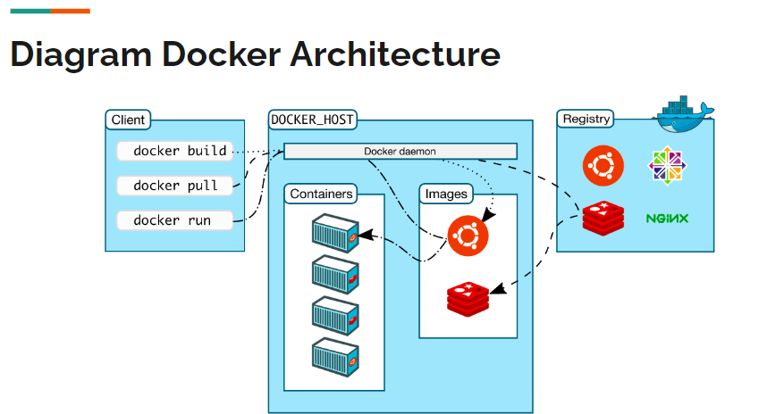

# DOCKER 


Materi belajar 
[Docker dasar](https://youtu.be/3_yxVjV88Zk?si=gRNTgPAG723_Ncxu)


## DOCKER DASAR 


<!-- Materi pengenalan container -->
#### 00:03:27  Pengenalan Container

Container Vs Docker 

* Berbeda dengan VM, Container sendiri berfokus pada sisi Aplikasi.
* Container sendiri sebenarnya berjalan diatas aplikasi Container Manager yang berjalan di sistem operasi.
* Yang membedakan dengan VM adalah, pada Container, kita bisa mem-package aplikasi dan dependency-nya tanpa harus menggabungkan sistem operasi.
* Container akan menggunakan sistem operasi host dimana Container Manager nya berjalan, oleh karena itu, Container akan lebih hemat resource dan lebih cepat jalan nya, karena tidak butuh sistem operasi sendiri.
* Ukuran Container biasanya hanya hitungan MB, berbeda dengan VM yang bisa sampai GB karena di dalamnya ada sistem operasinya.


<!-- Materi pengenalan docker  -->
#### 00:12:38 - Pengenalan Docker

Docker adalah salah satu implementasi Container Manager yang saat ini paling populer. Docker merupakan teknologi yang masih baru, karena baru diperkenalkan sekitar tahun 2013. Docker adalah aplikasi yang free dan Open Source, sehingga bisa kita gunakan secara bebas. https://www.docker.com/


<!-- Arsitektur docker -->
#### 00:14:46 - Arsitektur Docker

Docker menggunakan arsitektur Client-Server. Docker client berkomunikasi dengan Docker daemon (server). Saat kita menginstall Docker, biasanya didalamnya sudah terdapat Docker Client dan Docker Daemon. Docker Client dan Docker Daemon bisa berjalan di satu sistem yang sama. Docker Client dan Docker Daemon berkomunikasi menggunakan REST API. 




<!-- Menginstall docker -->
<!-- Docker resigtry -->
#### 00:26:27 - Docker Registry

Docker Registry adalah tempat kita menyimpan Docker Image. Dengan menggunakan Docker Registry, kita bisa menyimpan Image yang kita buat, dan bisa digunakan di Docker Daemon dimanapun selama bisa terkoneksi ke Docker Registry.

Contoh- contoh Docker Registry:

* [Docker Hub](https://hub.docker.com/) (free)
* [Digital Ocean Container Registry](https://www.digitalocean.com/products/container-registry/)
* [Google Cloud Container Registry ](https://cloud.google.com/container-registry )
* [Amazon Elastic Container Registry ](https://aws.amazon.com/id/ecr/)
* [Azure Container Registry](https://azure.microsoft.com/en-us/services/container-registry/)


<!-- Docker Image -->
#### 00:31:18 - Docker Image

Docker Image mirip seperti installer aplikasi, dimana di dalam Docker Image terdapat aplikasi dan dependency. Sebelum kita bisa menjalankan aplikasi di Docker, kita perlu memastikan memiliki Docker Image aplikasi tersebut. 

```sh
# Melihat list Image Docker 
docker image ls

# mendownload image docker dari hub.docker.com
docker image pull redis:latest

# hapus docker image yang sudah didownload
docker image rm redis:latest
```


<!-- Docker Container  -->
#### 00:40:45 - Docker Container

Jika Docker Image seperti installer aplikasi, maka Docker Container mirip seperti aplikasi hasil installernya. Satu Docker Image bisa digunakan untuk membuat beberapa Docker Container, asalkan nama Docker Container nya berbeda. 

Jika kita sudah membuat Docker Container, maka Docker Image yang digunakan tidak bisa dihapus, hal ini dikarenakan sebenarnya Docker Container tidak meng-copy isi Docker Image, tapi hanya menggunakannya isinya saja.


#### melihat Docker container
Melihat semua container didalam docker daemon/docker server bisa menggunakan perintah:

```sh
# melihat list container
docker container ls -a

# melihat yang sedang berjalan
docker container ls 
```

#### Membuat Docker Container

> ⚠️Tidak bisa membuat dua container dengan nama yang sama 

```sh
# membuat container baru dengan nama contohredis
docker container create --name contohredis redis:latest
```

#### Menjalankan & menghentikan docker container

```sh
# memulai container bisa dipanggil containerIDnya atau namanya
docker container start containerID/namaContainer
# contoh
docker container start contohredis

# menghentikan docker container
docker container stop containerID/namaContainer
# contoh
docker container stop contohredis
docker container stop contohredis2
```

#### Menghapus docker container

> ⚠️ tidak bisa menghapus docker container yang sedang berjalan, harus distop

```sh
# perintah hapus docker container
docker container rm contohredis
docker container rm contohredis2
```


<!-- Materi container log -->
#### 00:56:57 - Container Log

Kadang saat terjadi masalah dengan aplikasi yang terdapat di container, sering kali kita ingin melihat detail dari log aplikasinya. Hal ini dilakukan untuk melihat detail kejadian apa yang terjadi di aplikasi, sehingga akan memudahkan kita ketika mendapat masalah. 

Untuk melihat log aplikasi di container kita, kita bisa menggunakan perintah :
```sh
docker container logs containerId/namacontainer
```
Atau jika ingin melihat log secara realtime, kita bisa gunakan perintah :
```sh
docker container logs -f containerId/namacontainer
```


<!-- Materi container exec -->
#### Container Exec 

Saat kita membuat container, aplikasi yang terdapat di dalam container hanya bisa diakses dari dalam container. Oleh karena itu, kadang kita perlu masuk ke dalam container nya itu sendiri. Untuk masuk ke dalam container, kita bisa menggunakan fitur **Container Exec**, dimana digunakan untuk mengeksekusi kode program yang terdapat di dalam container.

Untuk masuk ke dalam container, kita bisa mencoba mengeksekusi program bash script yang terdapat di dalam container dengan bantuan Container Exec :
```sh
docker container exec -i -t containerId/namacontainer /bin/bash
```
* -i adalah argument interaktif, menjaga input tetap aktif
* -t adalah argument untuk alokasi pseudo-TTY (terminal akses)
Dan /bin/bash contoh kode program yang terdapat di dalam container

catatan:
```sh
# masuk container 
docker container exec -i -t contohredis /bin/bash
# exit 
exit
```


<!-- Materi container port -->
#### 01:07:17 - Container Port

Saat menjalankan container, container tersebut terisolasi di dalam Docker. Artinya sistem Host (misal Laptop kita), tidak bisa mengakses aplikasi yang ada di dalam container secara langsung, salah satu caranya adalah harus menggunakan Container Exec untuk masuk ke dalam container nya.

Biasanya, sebuah aplikasi berjalan pada port tertentu, misal saat kita menjalankan aplikasi Redis, dia berjalan pada port 6379, kita bisa melihat port apa yang digunakan ketika melihat semua daftar container.

##### Port forwading

Docker memiliki kemampuan untuk melakukan port forwarding, yaitu meneruskan sebuah port yang terdapat di sistem Host nya ke dalam Docker Container. Cara ini cocok jika kita ingin mengekspos port yang terdapat di container ke luar melalui sistem Host nya.


Untuk melakukan port forwarding, kita bisa menggunakan perintah berikut ketika membuat container nya :

```sh
docker container create --name namacontainer --publish posthost:portcontainer image:tag

# contoh
# download image nginx 
docker image pull nginx:latest
# buat container baru dengan image nginx
docker container create --name contohnginx --publish 8080:80 nginx:latest
# saat contohnginx dijalankan, nginx bisa diakses dilocalhost hostnya, 
# di port 8080 (localhost:8080 dibrowser)
```

Jika kita ingin melakukan port forwarding lebih dari satu, kita bisa tambahkan dua kali parameter ``--publish`` (juga bisa disingkat menggunakan -p). 


<!-- Materi container environment variable -->
#### Container Environment Variable 

Saat membuat aplikasi, menggunakan Environment Variable adalah salah satu teknik agar konfigurasi aplikasi bisa diubah secara dinamis. Dengan menggunakan environment variable, kita bisa mengubah-ubah konfigurasi aplikasi, tanpa harus mengubah kode aplikasinya lagi. 

Docker Container memiliki parameter yang bisa kita gunakan untuk mengirim environment variable ke aplikasi yang terdapat di dalam container.

Untuk menambah environment variable, kita bisa menggunakan perintah --env atau -e, misal :

```sh
docker container create --name namacontainer --env KEY=”value” --env KEY2=”value” image:tag

# contoh menerapkan pada image mongodb, dengan username dan passswordnya sebagai env 
# unduh mongo image latest dulu 
docker image pull mongo:latest
docker container create --name contohmongo --publish 27017:27017 --env MONGO_INITDB_ROOT_USERNAME=yusuf --env MONGO_INITDB_ROOT_PASSWORD=yusuf mongo:latest
```

 


<!-- Materi container stats -->
#### 01:26:20 - Container Stats

Saat menjalankan beberapa container, di sistem Host, penggunaan resource seperti CPU dan Memory hanya terlihat digunakan oleh Docker saja. Kadang kita ingin melihat detail dari penggunaan resource untuk tiap container nya.

Untungnya docker memiliki kemampuan untuk melihat penggunaan resource dari tiap container yang sedang berjalan
Kita bisa gunakan perintah :

```sh
docker container stats
```

###### Container Resource Limit

Saat membuat container, secara default dia akan menggunakan semua CPU dan Memory yang diberikan ke Docker (Mac dan Windows), dan akan menggunakan semua CPU dan Memory yang tersedia di sistem Host (Linux). Jika terjadi kesalahan, misal container terlalu banyak memakan CPU dan Memory, maka bisa berdampak terhadap performa container lain, atau bahkan ke sistem host

Oleh karena itu, ada baiknya ketika kita membuat container, kita memberikan resource limit terhadap container nya.

Memory 

* Saat membuat container, kita bisa menentukan jumlah memory yang bisa digunakan oleh container ini, dengan menggunakan perintah ``--memory`` diikuti dengan angka memory yang diperbolehkan untuk digunakan.
* Kita bisa menambahkan ukuran dalam bentu b (bytes), k (kilo bytes), m (mega bytes), atau g (giga bytes), misal 100m artinya 100 mega bytes.

CPU

* Selain mengatur Memory, kita juga bisa menentukan berapa jumlah CPU yang bisa digunakan oleh container dengan parameter ``--cpus``.
* Jika misal kita set dengan nilai 1.5, artinya container bisa menggunakan satu dan setengah CPU core. 

```sh
# contoh resource limit
docker container create --name smallnginx --memory 100m --cpus 0.5 --publish 8081:80 nginx:latest
```


<!-- Materi bind mounts -->
#### 01:38:10 - Bind Mounts


<details>
<summary> </summary>

</details>
