# Postgres SQL 🐘


Catatan belajar postgresql 
<details> 
<summary> Sumber pembelajaran dari yt Programmer Zaman Now (Click to expand!)  </summary>

link youtube :
https://youtu.be/iEeveYoD0SA?si=wGV7oYYJ0rdBuUWG
link slide :
https://docs.google.com/presentation/d/1OEkr3TlSUwMPSw5g-KjE55nA9H-Y66lo-jKv4QbzlpM/edit?usp=sharing

</details>


Download postgersql 
https://www.postgresql.org/download/


```
Masuk ke postgresql client (tanpa kutip/" "):
"psql --host=localhost --port=5432 --dbname=postgres --username=khannedy --password"

command membuat & menghapus database
create database nama_database;
drop database nama_database;

Meliat list database di postgresql : "\l" (ini L)
atau menggunakan perintah : "select datname from pg_database;"

comand cmd ganti db (setelah login) : "\c nama_database"

Melihat list table di database : "\dt"   

Melihat strukture table di database : "\d table_name"

Backup database ke file :
pg_dump --host=localhost --port=5432 --dbname=belajar --username=yourname --format=plain --file=Users/yourname/backup.sql

restore database dari file hasil backup :
psql --host=localhost --port=5432 --dbname=belajar_restore --username=yourname --file=Users/yourname/backup.sql 
```

<!-- Materi tipe data -->
#### Tipe Data

<details>
<summary> 00:41:05 - Tipe Data </summary>

#### Tipe data Number 

Secara garis besar, tipe data number di PostgreSQL ada dua jenis;

* Integer, atau tipe number bilangan bulat
* Floating Point, atau tipe data number pecahan

Ada juga tipe data desimal/numeric, ini tipe data number khusus yang bisa ditentukan jumlah precision dan scale nya. Dokumentasi mengenai tipe data number bisa dilihat [disini](https://www.postgresql.org/docs/current/datatype-numeric.html).

#### Tipe data String 

Tipe data String atau Text ada banyak di PostgreSQL. 

##### Pertama tipe data String : CHAR dan VARCHAR

Kita bisa menentukan jumlah panjang maksimal karakter yang bisa ditampung oleh CHAR dan VARCHAR dengan menggunakan kurung buka lalu masukan jumlah maksimal karakter dan diakhiri kurung tutup. Misal, CHAR(10) atau VARCHAR(10) artinya tipe data String dengan maksimal jumlah karakternya adalah 10 karakter. Maksimum ukuran CHAR atau VARCHAR adalah 65535 karakter. 

##### Kedua Tipe data string : Text 

Berbeda dengan CHAR dan VARCHAR yang kita bisa tentukan panjang maksimum nya, TEXT tidak memiliki maksimum  panjang nya. 

#### Tipe data Date & Time

Sebenarnya bisa kita gunakan String untuk menyimpan data waktu atau tanggal, namun itu tidak direkomendasikan, karena akan menyulitkan kita ketika nanti butuh melakukan manipulasi waktu atau tanggal di PostgreSQL. Ada beberapa jenis tipe data date & time lengkapnya bisa dicek [disini](https://www.postgresql.org/docs/current/datatype-datetime.html).

#### Tipe data Boolean

BOOLEAN adalah tipe data kebenaran, yang artinya datanya hanya ada dua jenis, benar atau salah. Benar direpresentasikan dengan data TRUE, sedangkan salah direpresentasikan dengan data FALSE.

#### Tipe data ENUM

Saat membuat kolom, kadang ada jenis tipe data Text, namun isi datanya sudah fix, misal Jenis Kelamin, Kategori, dan sejenisnya. Kasus seperti itu bisa menggunakan tipe data Enum. Tipe data Enum harus dibuat terlebih dahulu, dan ditentukan Value yang diperbolehkan

Untuk membuat tipe data enum, kita bisa menggunakan perintah SQL:
```sql
CREATE TYPE NAMA_ENUM AS ENUM ('VALUE1, ‘VALUE2’, 'VALUE3');
```

#### Tipe data lainnya 

Sebenarnya masih banyak jenis tipe data yang lain yang didukung oleh PostgreSQL, namun itu bisa kita pelajari jika memang ada kebutuhan spesifik. Seperti misal tipe data binary, json, xml dan lain-lain. Dokumentasi lengkapnya [disini](https://www.postgresql.org/docs/current/datatype.html).
</details>


<!-- Materi table  -->
#### Table

<details>
<summary>00:59:56 - Table </summary>

Sebelum kita bisa memasukkan data ke tabel, kita wajib terlebih dahulu membuat tabelnya terlebih dahulu. Dan tiap tabel yang kita buat, wajib ditentukan kolom-kolom nya, dan tipe data tiap kolom nya. Kita juga bisa mengubah tabel yang sudah terlanjur dibuat, seperti menambah kolom baru, mengubah kolom yang sudah ada, atau menghapus kolom. 

```sql
-- membuat table
create table barang(
	kode INT not null,
	name varchar(100) not null,
	harga int not null default 1000,
	jumlah int not null default 0,
	waktu_dibuat TIMESTAMP not null default current_timestamp 
);
-- merubah table yang sudah ada
alter table barang
add column deskripsi text;
```
</details>


<!-- Materi insert dan select -->
#### Insert & Select Data

<details>
<summary> 01:15:27 - Insert & Select Data </summary>

#### Insert Data 

Untuk memasukkan data kedalam tabel, kita bisa menggunakan perintah SQL yang bernama **INSERT**. Contoh query insert data ke table:

```sql 
insert into products(id, name, price, quantity)
values('P0001','Mie Ayam Original',15000, 100);

insert into products(id, name, description, price, quantity)
values('P0002','Mie Ayam Baso Tahu', 'Mie Ayam original + baso tahu', 20000, 100);
-- contoh insert multple data
insert into products(id, name, price, quantity)
values('P0003','Mie Ayam Ceker',20000, 100),
	('P0004','Mie Ayam Spesial',25000, 100),
	('P0005','Mie Ayam Yamin',15000, 100);

```

#### Select Data 

Untuk mengambil data di tabel, kita bisa menggunakan SQL dengan kata kunci **SELECT**. SELECT bisa digunakan untuk mengambil semua kolom yang ada di tabel, atau sebagian kolom saja. Jika kita ingin mengambil semua kolom, kita bisa gunakan karakter * (bintang). Jika kita hanya ingin mengambil beberapa kolom saja, kita bisa sebutkan nama-nama kolom yang ingin kita ambil datanya. 

```sql
-- select semua data menggunakan bintang 
select * from products;
-- select kolom tertentu saja
select id, name, price, quantity from products;

```
</details>


<!-- Materi primary key -->
#### Primary Key

<details>
<summary> 01:26:42 - Primary Key </summary>

Primary key adalah sebuah kolom yang kita tunjuk sebagai id dari tabel tersebut. Primary key adalah identitas untuk tiap baris data di dalam tabel. Primary key harus unik, tidak boleh ada data dengan primary key yang sama. Contoh membuat table ``products`` dengan primary key ``id``:

```sql 
-- membuat table baru dengan primary key
create table products(
	id VARCHAR(10) not null,
	name VARCHAR(100) not null,
	description text, 
	price int not null,
	quantity int not null default 0,
	created_at TIMESTAMP not null default CURRENT_TIMESTAMP, 
	primary key (id)
);
-- menabahkan primary key pada table yang sudah ada
alter table products add primary key (id);
```
</details>


<!-- Materi where clause  -->
#### Where Clause

<details>
<summary> 01:29:58 - Where Clause</summary>

Saat mengambil data menggunakan perintah SQL SELECT, kadang kita ingin melakukan pencarian data. Misal, kita ingin mengambil data barang yang harganya 1jt, atau mengambil data barang yang quantity nya 0 (stok nya kosong). Hal ini bisa kita lakukan dengan **WHERE clause** setelah perintah **SELECT**.
```sql 
-- contoh 1
select * from products where name='Mie Ayam Spesial';
-- contoh 2 
select id, name, price, quantity from products where price=20000;
-- contoh 3
select id, name, price, quantity from products where id='P0004';
```
</details>


<!-- Materi update & delete -->
#### Update & delete

<details>
<summary>01:32:28 - Update & delete  </summary>

Untuk mengubah data di tabel, kita bisa menggunakan perintah SQL UPDATE. Saat menggunakan SQL UPDATE, kita harus memberi tahu data mana yang akan di update dengan WHERE clause.

> ⚠️Hati-hati ketika meng-update data di table, jika sampai WHERE clause nya salah, bisa-bisa kita malah meng-update seluruh data di tabel

```sql
-- contoh update data P0001, set categorynya menjadi makanan
update products set category = 'makanan' where id = 'P0001';

-- contoh mengubah beberapa kolom sekaligus
update products 
	set category = 'makanan',
	description = 'mie ayam + ceker'
where id = 'P0003';

-- contoh mengubah dengan value dikolom
update products set price = price + 5000 where id = 'P0004';
```

#### DELETE data 

Setelah kita tahu cara menambah, mengubah dan mengambil data di tabel, terakhir yang perlu kita ketahui adalah menghapus data di table. Untuk menghapus data di table, kita bisa menggunakan perintah SQL DELETE. Perintah SQL DELETE sama seperti UPDATE, kita perlu memberi tahu data mana yang akan di hapus dengan WHERE clause. 

> ⚠️Hati-hati, jangan sampai salah menentukan WHERE clause, karena jika salah, bisa-bisa kita akan menghapus seluruh data di table

```sql
-- delete data P0009 dari table products
delete from products 
where id = 'P0009';
```
</details>


<!-- Materi alias  -->
#### Alias

<details>
<summary> 01:43:58 - Alias</summary>

PostgreSQL memiliki fitur untuk melakukan alias untuk kolom dan tabel. Alias berguna jika kita ingin mengubah nama kolom atau nama tabel ketika melakukan SELECT data. Mungkin saat ini alias untuk tabel tidak terlalu terlihat gunanya, tapi nanti ketika kita telah mempelajari tentang JOIN, maka fitur alias untuk tabel sangat berguna sekali. Contoh pemakaian alias :

```sql 
select p.id as "kode barang",
	p.price as "harga barang",
	p.description as "deskipsi barang" 
from products as p;
```
</details>


<!-- Materi where operator -->
#### where operator

<details>
<summary> 01:49:42 - Where Operator (Perbandingan, AND OR, like, null, between, IN)</summary>

#### Operator Perbandingan

| Operator | Keterangan  |
| -------- | ----------- |
| =        | Sama dengan |
| <>       | atau        |
| !=       | Tidak sama dengan |
| <        | Kurang dari |
| <=       | Kurang dari atau sama dengan |
| >        | Lebih dari  |
| >=       | Lebih dari atau sama dengan |

contoh mencari data dengan operator perbandingan 
```sql
select * from products where price > 15000;

select * from products where price <= 15000;

select * from products where category != 'minuman';
```

#### AND & OR operator 
Kadang kita ingin mencari data dengan beberapa gabungan kondisi, kita bisa menggunakan operator ``AND`` dan ``OR``. AND dan OR digunakan untuk menggabungkan beberapa dua operator. Contoh : 

```sql
-- contoh 1 
select * from products where price > 15000 and category='makanan';
-- contoh 2 menggunakan OR & AND
select * from products where quantity>100 or category ='makanan' and price >10000;
```

Kita juga bisa menentukan prioritas operator dengan menambahkah tanda kurung (). Contoh :

```sql 
select * from products where category ='makanan' or (quantity>100 and price >10000);
```

#### LIKE Operator

LIKE operator adalah operator yang bisa kita gunakan untuk mencari sebagian data dalam String. Namun perlu diingat, operasi LIKE itu sangat lambat, oleh karena itu, tidak disarankan jika datanya sudah terlalu besar di tabel. 

Operasi LIKE **case sensitive**, jadi huruf besar dan kecil juga berpengaruh, jika kita ingin tidak case sensitive, bisa menggunakan ILIKE/ilike. Contoh operator ilike:

```sql 
select * from products where name ilike '%mie%';
```

#### NULL Operator 

Untuk mencari data yang berisi NULL, kita tidak bisa menggunakan operator perbandingan = NULL. Dan untuk mencari yang tidak null bisa menggunakan IS NOT NULL.

```sql
-- conton is null
select * from products where description is null;
-- contoh is not null
select * from products where description is not null;
```

#### BETWEEN Operator 

Kadang kita ingin mencari data yang >= dan <= secara sekaligus. Misal kita ingin mencari products yang harganya antara 10000 sampai 20000. Untuk melakukan ini, kita bisa menggunakan WHERE price >= 10000 AND price <= 20000

Namun ada operator **BETWEEN** yang bisa kita gunakan agar lebih sederhana. Untuk kebalikannya, kita bisa gunakan **NOT BETWEEN**.

```sql 
-- contoh between
select * from products where price between 10000 and 20000;
-- contoh not between 
select * from products where price not between 10000 and 20000;
```

#### IN Operator 

Operator IN adalah operator untuk melakukan pencarian sebuah kolom dengan beberapa nilai. Misal kita ingin mencari products dengan category Makanan atau Minuman, maka kita bisa menggunakan **operator IN**. Untuk kebalikannya, kita bisa menggunakan **NOT IN**

```sql 
select * from products where category in ('makanan', 'minuman');
```
</details>


<!-- Order by clause -->
#### Order By Clause

<details>
<summary> 02:16:06 - Order By Clause </summary>

Untuk mengurutkan data ketika kita menggunakan perintah SQL SELECT, kita bisa menambahkan ORDER BY clause. **ORDER BY clause** digunakan untuk mengurutkan data berdasarkan kolom yang dipilih, dan jenis urutan (ASC atau DESC). Kita juga bisa mengurutkan tidak hanya terhadap satu kolom, tapi beberapa kolom.
```sql 
-- contoh 
select * from products order by price asc, id desc;
```
</details>


<!-- materi limit clause -->
#### Limit Clause

<details>
<summary>02:18:41 - Limit Clause </summary>

Mengambil seluruh data di tabel bukanlah pilihan bijak, apalagi jika datanya sudah banyak sekali. Kita bisa membatasi jumlah data yang diambil dalam SQL SELECT dengan LIMIT clause. Selain membatasi jumlah data, kita juga bisa meng-skip sejumlah data yang tidak ingin kita lihat. LIMIT biasanya digunakan saat melakukan paging di aplikasi kita, dengan kombinasi OFFSET.

```sql 
-- contoh 1 limit clause
select * from products where price > 0 order by price asc, id desc limit 2;
-- contoh 2 limit clause + offset
select * from products where price > 0 order by price asc, id desc limit 2 offset 2;
```
</details>


<!-- materi distinct  -->
#### Select Distinct Data

<details>
<summary> 02:23:20 - Select Distinct Data</summary>

Saat melakukan query dengan SELECT, kadang kita mendapatkan data yang duplikat. Misal kita ingin melihat semua kategori di tabel products, maka otomatis hasil query SELECT akan duplikat, karena banyak sekali produk dengan kategori yang sama. 

Jika kita ingin menghilangkan data-data duplikat tersebut , kita bisa menggunakan SELECT dengan tambahan DISTINCT sebelum nama kolom nya. 

```sql
-- tanpa distinct
select category from products;
-- dengan ditinct
select distinct category from products;
```
</details>


<!-- Materi numeric function -->
#### Numeric Function

<details>
<summary> 02:25:03 - Numeric Function</summary>

PostgreSQL memiliki banyak sekali fitur untuk manipulasi data angka. Hal ini memudahkan kita untuk memanipulasi data angka. Secara garis besar, fitur ini dibagi menjadi dua, Arithmetic Operator dan Mathematical Function. 

#### Arithmetic Operator

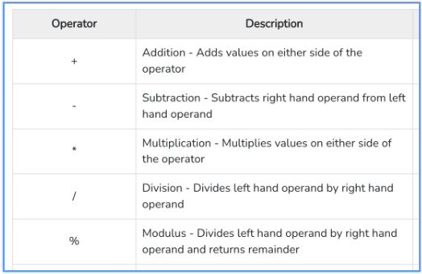

```sql
-- menggunakan arithmetic operator 
select 10 + 10 as hasil;
select id, price/1000 as price_in_k from products;
```

#### Mathematical Function

Ini adalah kumpulan function yang terdapat di PostgreSQL yang bisa kita gunakan sebagai fungsi-fungsi matematika. Ada banyak sekali tidak bisa dimuat disini semua, lengkapnya cek dokumentasinya [disini](https://www.postgresql.org/docs/15/functions-math.html). 

```sql 
-- beberapa contoh mathematical function
select pi();
select power(10,2);
select cos(10), sin(10), tan(10);
select id, name, power(quantity, 2) as quantity_power_2 from products;
```
</details>


<!-- Materi auto increment / serial -->
#### Auto Increment 

<details>
<summary> 02:31:36 - Auto Increment </summary>

PostgreSQL memiliki tipe data Number bernama **SERIAL**, fitur ini bisa kita gunakan untuk membuat function yang akan otomatis mengembalikan nilai yang selalu naik ketika dipanggil.

Dengan menggunakan SERIAL, kita tidak perlu lalu memasukkan data primary key secara manual, secara otomatis nilai primary key akan naik. 

Contoh membuat tabel admin dengan id serial:

```sql
create table admin(
	id SERIAL not null,
	first_name varchar(100) not null,
	last_name varchar(100),
	primary key(id)
);
-- melihat current value dari serial 
select currval('admin_id_seq');
```
</details>


<!-- Materi sequence  -->
#### Sequence 

<details>
<summary> 02:38:29 - Sequence </summary>

Saat kita menggunakan tipe data SERIAL, sebenarnya dibelakangnya, PostgreSQL menggunakan Sequence. **Sequence** adalah fitur dimana kita bisa membuat function auto increment.

Saat menggunakan tipe data SERIAL pada Primary Key, secara otomatis PostgreSQL akan membuat Sequence, dan memanggil function sequence nya sebagai default value untuk Primary Key nya.

```sql
-- membuat sequence 
create sequence contoh_sequence;
-- memanggil sequence, otomatis increment
select nextval('contoh_sequence');
-- melihat/mengambil nilai terakhir sequence 
select currval('contoh_sequence');

-- SERIAL = nextval('admin_id_seq)
-- perintah untuk melihat sequene yang ada di database 
-- cmd/psql = \ds

-- contoh menggunakan sequence manual pada saat membuat tabel
-- lebih baik menggunakan serial
create table admin(
	id int not null default nextval('admin_id_seq'),
	first_name varchar(100),
	last_name varchar(100),
	primary key(id)
);
```
</details>


<!-- materi string function -->
#### String Function 

<details>
<summary>02:44:47 - String Function </summary>

Sama seperti number, di PostgreSQL juga banyak menyediakan function untuk tipe data String. Ada banyak sekali function-function yang bisa kita gunakan. Detail string function bisa dicek [disini](https://www.postgresql.org/docs/15/functions-string.html).

Contoh salah satu string function:

```sql 
select id, lower(name), length(name), lower(description) from products;
```
</details>


<!-- Materi date and time function -->
#### Date dan Time Function

<details>
<summary> 02:47:22 - Date dan Time Function</summary>

PostgreSQL juga menyediakan banyak sekali function yang bisa kita gunakan untuk mengolah data tipe Date dan Time. Detail untuk datetime ada [disini](https://www.postgresql.org/docs/15/functions-datetime.html)

Contoh penggunaan date time:

```sql 
select * from products;
select id, extract(year from created_at), extract(month from created_at) from products;
```
</details>


<!-- Materi flow control function -->
#### Flow Control Function

<details>
<summary> 02:50:24 - Flow Control Function </summary>

PostgreSQL memiliki fitur flow control function. Ini mirip IF ELSE di bahasa pemrograman tapi tidak sekompleks pada bahasa pemograman. Detail informasi [disini](https://www.postgresql.org/docs/current/functions-conditional.html)

```sql
--contoh 1:
select id, category,
	case category
		when 'makanan' then 'enak'
		when 'minuman' then 'seger'
		else 'apa itu?' 
	end as category_case
from products;
-- conto 2:
select id, price,
	case 
		when price <= 15000 then 'murah'
		when price <= 20000 then 'mahal'
		else 'mahal banget'
	end as "apakah murah?"
from products;
-- contoh 3
select id, name, description from products;
select id, name, 
	case
		when description is null then 'kosong'
		else description 
	end as description
from products;
```
</details>


<!-- Materi agregate function -->
#### Aggregate Function

<details>
<summary>02:58:18 - Aggregate Function </summary>

PostgreSQL mendukung function-function untuk melakukan aggregate. Misal, kita ingin melihat harga paling mahal di tabel product, atau harga termurah, atau rata-rata harga produk, atau total jumlah data di tabel, dan lain-lain. Informasi detail [disini](https://www.postgresql.org/docs/current/functions-aggregate.html).

```sql 
-- contoh menghitung count/jumlah
select id from products;
select count(id) from products;
-- contoh average 
select avg(price) from products;
-- contoh mencari nilai min
select min(price) from products;
-- contohh mencari nilai max
select max(price) from products;
```
</details>


<!-- Materi Grouping  -->
#### Grouping

<details>
<summary> 03:01:33 - Grouping </summary>

Kadang saat melakukan aggregate, kita ingin datanya di grouping berdasarkan kriteria tertentu. Misal kita ingin melihat rata-rata harga product, tapi ingin per category.  Atau kita ingin melihat total semua product, tapi per category. Hal ini bisa dilakukan di PostgreSQL dengan menggunakan GROUP BY clause. 

**GROUP BY clause** ini hanya bisa digunakan jika kita menggunakan aggregate function.

```sql
-- group  by clause hanya bisa digunakan jika pakai aggregate function
-- contoh satu
select category, count(id) as "total product"
from products group by category; 
-- contoh dua 
select category, 
	avg(price) as "rata-rata harga", 
	min (price) as "Harga terendah",
	max(price) as "Harga termahal"
from products group by category; 
```

**HAVING clause**. Kadang kita ingin melakukan filter terhadap data yang sudah kita grouping. Misal kita ingin menampilkan rata-rata harga per kategori, tapi yang harganya diatas 10.000 misalnya. Jika menggunakan WHERE di SELECT, hal ini tidak bisa dilakukan untuk memfilter hasil aggregate function, kita harus menggunakan HAVING clause.

```sql
-- having clause / filter data yang sudah di grouping
-- contoh satu
select category,
	count(id) as total
from products group by category having count(id) > 3;
-- contoh dua 
select category, 
	avg(price) as "rata-rata harga", 
	min (price) as "Harga terendah",
	max(price) as "Harga termahal"
from products group by category having avg(price) >= 20000; 
```
</details>


<!-- constraint -->
#### Constraint

<details>
<summary> 03:09:14 - Constraint </summary>

Di PostgreSQL, kita bisa menambahkan constraint untuk menjaga data di tabel tetap baik. Constraint sangat bagus ditambahkan untuk menjaga validitas di program kita, sehingga data yang masuk ke database tetap akan terjaga.

**Unique constraint** adalah constraint yang memastikan bahwa data kita tetap unique. Jika kita mencoba memasukkan data yang duplikat, maka PostgreSQL akan menolak data tersebut.

```sql
-- table customer dengan email unique constraint 
-- mencegah data email duplikat.
create table customer(
	id serial not null,
	email varchar(100) not null,
	first_name varchar(100) not null,
	last_name varchar(100) not null,
	primary key (id),
	constraint unique_email unique(email)
);
```

**Check constraint** Check constraint adalah constraint yang bisa kita tambahkan kondisi pengecekannya. Ini cocok untuk mengecek data sebelum dimasukkan ke dalam database. Misal kita ingin memastikan bahwa harga harus diatas 1000 misal, maka kita bisa menggunakan check constraint.

```sql
-- check constraint (constraint yang digunakan untuk menambahkan kondisi cek)
alter table products 
	add constraint price_check check (price > 1000);

alter table products
	add constraint quantity_check check (quantity > 0);
```
</details>


<!-- Materi index -->
#### Index

<details>
<summary> 03:20:44 - Index </summary>

Secara default, PostgreSQL akan menyimpan data di dalam disk seperti tabel biasanya. Hal ini menyebabkan, ketika kita mencari data, maka PostgreSQL akan melakukan pencarian dari baris pertama sampai terakhir, yang artinya semakin banyak datanya, maka akan semakin lambat proses pencarian datanya.

Kita bisa ubah cara PostgreSQL menyimpan data pada kolom, agar mudah dicari, yaitu menggunakan **Index**. Saat kita membuat index, PostgreSQL akan menyimpan data dalam struktur data [B-Tree](https://en.wikipedia.org/wiki/B-tree). Tidak hanya akan mempermudah kita saat melakukan pencarian, index juga akan mempermudah kita ketika melakukan pengurutan menggunakan **ORDER BY**. 

> index adalah teknik menambahkan index pada kolom data agar memudahkan pencarian (Btree)

Kita bisa membuat lebih dari satu index pada tiap table. Satu index bisa dipakai untuk beberapa kolom index(col1, col2, col3) artinya kita bisa gunakan (col1), (col1, col2), dan (col1,col2,col3)
```sql
-- index sellers_id_and_name_index, mempercepat pencarian (id) atau (id dan nama)
-- tidak mempercepat untuk pencarian nama saja. 
create index sellers_id_and_name_index on sellers(id,name);
select * from sellers where id =1;
select * from sellers where id=1 or name ='galeri Tono';
```

> kekurangan : index mempercepat pencarian query tapi memperlambat proses insert, update, delete. Karena setiap kali kita melakukan perubahan data data query maka akan terjadi proses updata index.

⚠️ Tidak perlu menambahkan index pada primary key atau unique contraint karena sudah ada indexnya.

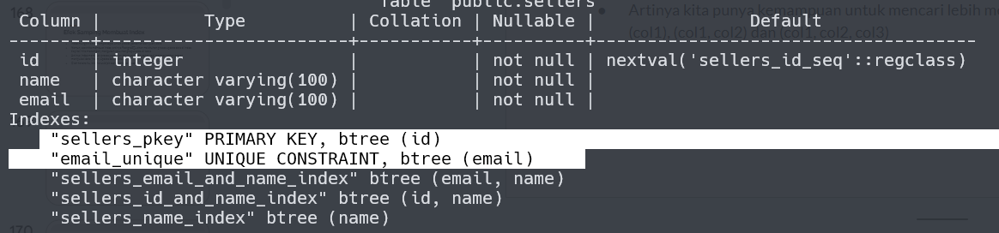
</details>


<!-- full text search  -->
#### Full Text Search 

<details>
<summary> 03:36:03 - Full Text Search </summary>

Ketika melakukan proses pencarian di database biasanya perintah yang digunakan adalah perintah like/ilike. Namun perintah ini dinilai lamban jika database sudah mencapai puluhan ribu, karena operasi ini bekerja dengan mencari seluruh data tabel dari awal hingga paling akhir. Postgersql menyediakan perintah [full text search](https://www.postgresql.org/docs/current/textsearch-intro.html) untuk mengatasi perintah ini. Adapaun kekurangan dan kelebihan full text ini:

* LIKE lamban karena mencari seluruh data di tabel dari baris pertama sampai akhir (tidak pakai index)
* full-text bisa digunakan untuk mencari sebagian kata di kolom dengan tipe data string
* tidak flexible karena hanya mencari perkata tidak seperti like yang bisa mencari sepersukukata
* Di PostgreSQL, Full-Text Search menggunakan function to_tsvector(text) dan to_tsquery(query)
* bisa menggunakan function tersebut tanpa membuat index, namun performanya akan sama saja dengan LIKE, lambat karena harus di cek satu-satu

```sql
-- full search / tidak menggunakan index
select * from products where name ilike '%mie%';
select * from products where to_tsvector(name) @@ to_tsquery('mie');
```

Untuk membuat index Full-Text Search kita bisa menggunakan perintah yang sama dengan index biasa, tapi harus disebutkan detail dari jenis index Full-Text Search nya

```sql
-- lihat bahasa
select cfgname from pg_ts_config;
--buat index
create index products_name_search on products using gin(to_tsvector('indonesian', name));
create index products_description_search on products using gin(to_tsvector('indonesian', description));
-- saat pakai tidak usah pakai to_tsvector tapi langsung to_tsquery
select * from products where name @@ to_tsquery('mie');
select * from products where description  @@ to_tsquery('mie');
```

query operator di full-text search, **to_tsquery** mendukung operator : &/AND, |/or, !/NOT, ""/semua data

```sql 
select * from products where name @@ to_tsquery('mie & baso'); -- and
select * from products where name @@ to_tsquery('mie | baso'); -- or
select * from products where name @@ to_tsquery('!baso'); -- not
select * from products where name @@ to_tsquery('''mie ayam'''); -- '' '' mencari detail/tepat satu kalimat
```

> Kita juga bisa secara otomatis membuat kolom dengan tipe data **TSVECTOR**. Secara otomatis kolom tersebut berisi text yang memiliki index Full-Text Search
</details>


<!-- Materi table relationship -->
#### Table Relationship

<details>
<summary> 03:49:16 - Table Relationship </summary>

Dalam Relational DBMS, salah satu fitur andalan nya adalah table relationship. Yaitu relasi antar tabel kita bisa melakukan relasi dari satu tabel ke tabel lain. 

Saat membuat relasi tabel, biasanya kita akan membuat sebuah kolom sebagai referensi ke tabel lainnya. Misal saat kita membuat tabel penjualan, di dalam tabel penjualan, kita akan menambahkan kolom id_produk sebagai referensi ke tabel produk, yang berisi primary key di tabel produk. Kolom referensi ini di PostgreSQL dinamakan **Foreign Key**.

```sql
create table wishlist(
	id serial not null,
	id_product varchar(10) not null,
	description text,
	primary key(id),
	constraint fk_wishlist_product foreign key (id_product) references products (id)
);
```

Ketika menghapus data berelasi, secara default PostgreSQL akan menolak operasi delete tersebut, hal ini karena default behaviornya adalah restrict. Fitur ini dapat dirubah dengan cara merubah ``constraint foreign key``nya. Seperti contoh berikut:

```sql
alter table wishlist 
add constraint fk_wishlist_product foreign key(id_product) references products(id)
on delete cascade on update cascade;
```

Selain ``restrict`` dan ``cascade``, ada beberapa sintaks dengan fungsinya masing-masing yaitu:

|   bahavior   |      ON DELETE       | ON UPDATE |
| ------------ | -------------------- | --------- |
| RESTRICT     | ditolak              | ditolak   |
| CASCADE      | data dihapus         | data dihapus |
| NO ACTION    | data dibiarkan | data dibiarkan |
| SET NULL     | diubah null | diubah null |
| SET DEFAULT  | diubah default value | diubah default value |

</details>


<!-- materi join -->
#### Join

<details>
<summary> 04:02:47 - Join </summary>

PostgreSQL mendukung query SELECT langsung ke beberapa tabel secara sekaligus. Namun untuk melakukan itu, kita perlu melakukan JOIN di SQL SELECT yang kita buat. Untuk melakukan JOIN, kita perlu menentukan tabel mana yang merupakan referensi ke tabel lain. 

Join cocok sekali dengan foreign key, walaupun di PostgreSQL tidak ada aturan kalau JOIN harus ada foreign key. Join di PostgreSQL bisa dilakukan untuk lebih dari beberapa tabel

> Idealnya kita melakukan JOIN jangan lebih dari 5 tabel, karena itu bisa berdampak ke performa query yang lambat

```sql
-- contoh, join dengan alias
select p.id, c.email, p.name, w.description
from wishlist as w 
	join products as p on w.id_product = p.id 
	join customer as c on c.id = w.id_customer;
```
</details>


<!-- Materi One to one ralationship -->
#### One to One Relationship

<details>
<summary>04:11:54 - One to One Relationship</summary>

**One to One relationship** adalah relasi antar tabel yang paling sederhana. Artinya tiap data di sebuah tabel hanya boleh berelasi ke maksimal 1 data di tabel lainnya tidak boleh ada relasi lebih dari 1 data.

Contoh misal, kita membuat aplikasi toko online yang terdapat fitur wallet, dan 1 customer, cuma boleh punya 1 wallet.

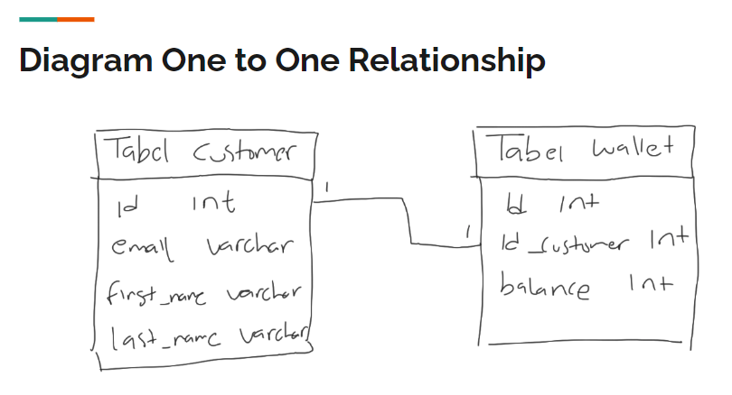

Cara membuat One to One relationship cukup mudah, kita bisa membuat kolom foreign key, lalu set kolom tersebut menggunakan **UNIQUE KEY**, hal ini dapat mencegah terjadi data di kolom tersebut agar tidak duplikat.

Atau cara lainnya, kita bisa membuat tabel dengan primary key yang sama, sehingga tidak butuh lagi kolom untuk FOREIGN KEY.

```sql

-- membuat table wallet 
create table wallet (
	id serial not null,
	id_customer int not null,
	balance int not null default 0,
	primary key (id),
	constraint wallet_customer_unique unique (id_customer),
-- UNIQUE memastikan bahwa id_customer tidak ada yg sama datanya
	constraint fk_wallet_customer foreign key (id_customer) references customer(id)
);
```
</details>


<!-- Materi one to Many -->
#### One to Many Relationship

<details>
<summary> 04:18:17 - One to Many Relationship
</summary>

**One to many relationship** adalah relasi antar tabel dimana satu data bisa digunakan lebih dari satu kali di tabel relasinya.Berbeda dengan one to one yang cuma bisa digunakan maksimal 1 kali di tabel relasinya, one to many tidak ada batasan berapa banyak data digunakan.

Contoh relasi antar tabel categories dan products, dimana satu category bisa digunakan oleh lebih dari satu product, yang artinya relasinya one category to many products.

Pembuatan relasi one to many sebenarnya sama dengan one to one, yang membedakan adalah, kita tidak perlu menggunakan ``UNIQUE KEY``, karena datanya memang bisa berkali-kali ditambahkan di tabel relasinya.

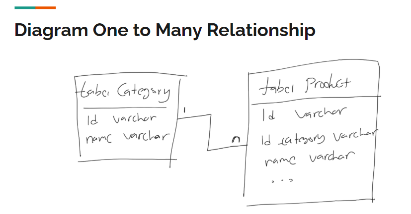

```sql
-- membuat table categoies 1 to N products
create table categories(
	id varchar(10) not null,
	name varchar(100) not null,
	primary key (id)
);

-- rubah table products
alter table products
add column id_category varchar(10)
add constraint fk_product_category foreign key(id_category) references categories(id);
```
</details>


<!-- Materi Many to Many relationship -->
#### Many to Many Relationship

<details> 
<summary> 04:25:52 - Many to Many Relationship </summary>

**Many to Many** adalah relasi dimana ada relasi antara 2 tabel dimana table pertama bisa punya banyak relasi di table kedua, dan table kedua pun punya banyak relasi di table pertama.

Ini memang sedikit membingungkan, bagaimana caranya bisa relasi kebanyakan secara bolak balik, sedangkan di table kita cuma punya 1 kolom?

Contoh relasi many to many adalah relasi antara produk dan penjualan, dimana setiap produk bisa dijual berkali kali, dan setiap penjualan bisa untuk lebih dari satu produk.

Solusi yang biasa dilakukan jika terjadi relasi many to many adalah, biasanya kita akan <u>menambah 1 tabel ditengahnya</u>. Tabel ini bertugas sebagai jembatan untuk menggabungkan relasi many to many. Isi table ini akan ada id dari table pertama dan table kedua, dalam kasus ini adalah ``id_product`` dan ``id_order``. Dengan demikian, kita bisa menambahkan beberapa data ke dalam tabel relasi ini, sehingga berarti satu product bisa dijual beberapa kali di dalam table order, dan satu order bisa membeli lebih dari satu product.

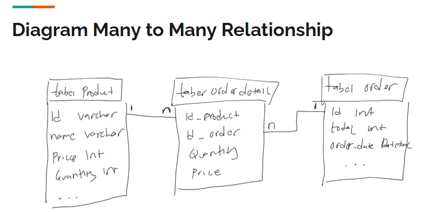

```sql 
-- Pemecahan masalah : products(N) to (N)orders
-- jadi : products(N) to (1)orders_detail(1) to (N)orders
-- table products sudah dibuat
-- table orders 
create table orders(
	id serial not null,
	total int not null,
	order_date timestamp not null default current_timestamp,
	primary key(id)
);
-- buat table orders detail
create table orders_detail(
	id_product varchar(10) not null,
	id_order int not null,
	price int not null,
	quantity int not null,
	primary key(id_product, id_order),
    add constraint fk_order_detail _product foreign key (id_product) references products(id),
    add constraint fk_order_detail_order foreign key (id_order) references orders(id)
);

```
</details>


<!-- Materi jenis-jenis join -->
#### Jenis Jenis Join

<details>
<summary> 04:40:55 - Jenis Jenis Join </summary>

**INNER JOIN (default join)**

**Inner join** adalah mekanisme JOIN, dimana terdapat relasi antara tabel pertama dan tabel kedua. Jika ada data di tabel pertama yang tidak memiliki relasi di table kedua ataupun sebaliknya, maka hasil INNER JOIN tidak akan ditampilkan. 

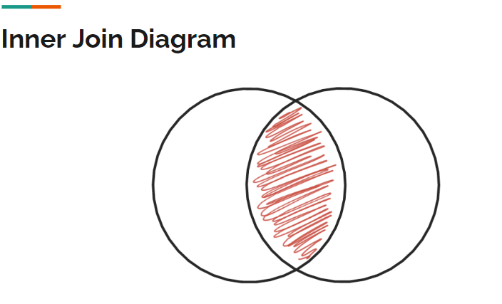

contoh query inner join :
```sql
select * from categories
inner join products on products.id_category = categories.id;
```

**LEFT JOIN**

**left join** adalah join yang seperti inner join, tapi semua data ditable pertama akan diambil, ditable kedua hanya yang berelasi yang diambil datanya.

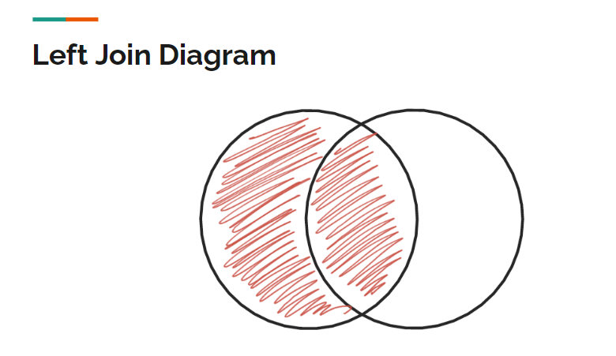

contoh query left join:
```sql
select * from categories
left join products on products.id_category = categories.id;
```

**RIGHT JOIN**

**Right join** adalah join seperti inner join, semua data ditable kedua akan diambil,tapi ditable pertama hanya akan menampilkan data yag berelasinya saja. (kebalikan left join).

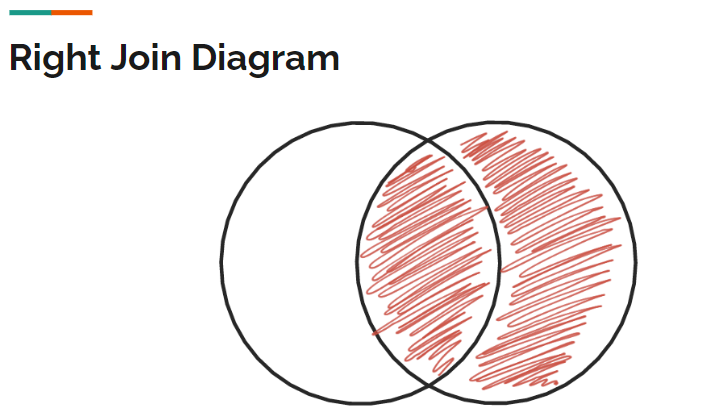

Contoh query right join:
```sql
select * from categories
right join products on products.id_category = categories.id;
```

**FULL JOIN**

FULL JOIN adalah join yang semua data di tabelnya pertama dan kedua diambil/ditampilkan, jika tidak ada relasi maka hasilnya null.

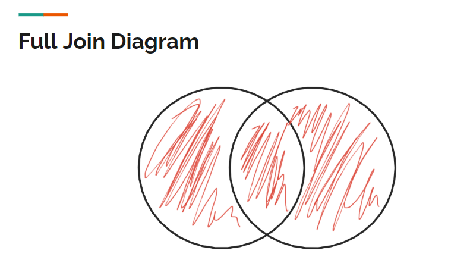

Contoh query full join:
```sql
select * from categories
full join products on products.id_category = categories.id;

```
</details>


<!-- Materi Subqueries -->
#### Subqueries

<details>
<summary> 04:50:05 - Subqueries </summary>

**subqueries** adalah query yang ada didalam query yang lain, bisa digunakan untuk pencarian where dari hasil select query ataupun aggregate function.

```sql
-- subquery di where
select avg(price) from products;  -- aggregate function
select * from products where price > (select avg(price) from products);
```
```sql
-- subquery di from
select max(price) from (select products.price as price
from categories join products on products.id_category = categories.id) as contoh;
```
</details>


<!-- Materi set operator -->
#### Set Operator

<details>
<summary> 04:54:46 - Set Operator </summary>

**operator set**, dimana ini adalah operasi antara hasil dari dua SELECT query. Ada beberapa jenis operator set yaitu ; UNION, UNION ALL, INTERSECT, EXCEPT. 

**operator set : UNION**

Union adalah operasi menggabungkan dua buah select query, dimana jika terdapat data yang duplikat, data duplikasinya akan dihapus dari hasil query. contoh:
```sql
select distinct email from customer 
union
select distinct email from guestbooks;
--distinct hanya untuk menghilangkan data duplikat
```
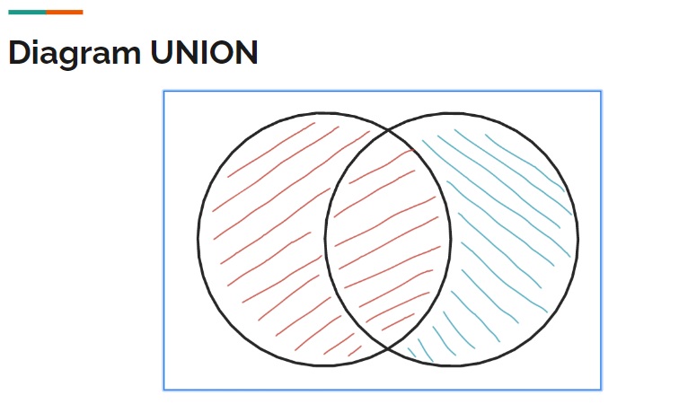

**set operator : UNION ALL**

union all adalah operasi union, tapi data hasil duplikat tetap akan ditampilkan di hasil querynya. contoh :
```sql
select distinct email from customer
union all
select distinct email from guestbooks;
```
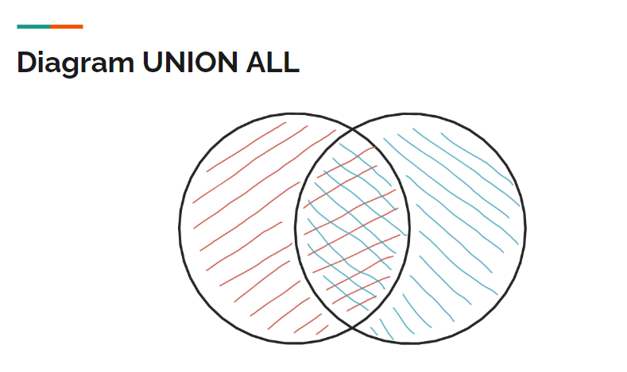

**set operator : INTERSECT**

intersect adalah operasi menggabungkan dua query, tapi yang diambil/ditampilkan hanya yang datanya ada dihasil query pertama dan kedua, dan datanya muncul tidak dalam keadaan duplikat. contoh:
```sql
select distinct email from customer
intersect
select distinct email from guestbooks;
```
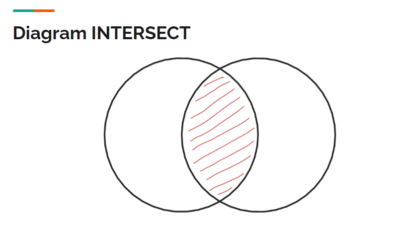

**set operator : EXCEPT**

except adalah operasi dua query dimana, jika data itu sama pada query pertama dan query kedua maka data tidak akan ditampilkan. contoh:
```sql
select distinct email from customer
except
select distinct email from guestbooks;
```
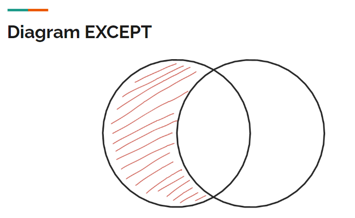

> Adapun ``set operator`` bisagunakan pada **subquery**

```sql
-- set operator union all pada subquery
select email, count(email) 
from (select email from customer 
    union all 
    select email from guestbooks) as contoh 
group by email;
```
Query tersebut untuk menghitung duplikat email pada table customer dan guestbooks, hasilnya akan seperti ini:
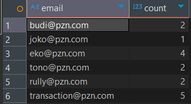
</details>


<!-- Materi transaction -->
#### Transaction

<details>
<summary> 05:05:28 - Transaction </summary>

**Transaction** adalah cara atau mekanisme membungkus beberapa perintah sekaligus menjadi satu operasi, hal ini bertujuan agar data tetap konsisten. Kenapa bisa konsisten? karena semua perintah yang ada dalam transaction harus berhasil semuanya atau gagal semuanya. 

contoh kasus aplikasi belanja online ketika customer menekan tombol pesan maka yt terjadi:

* insert data tabel order pesanan, 
* insert data detail order pesanan,  
* menurunkan quantity di table product dll.

Jika terjadi kesalahan/pembatalan disalah satu perintah harapannya perintah sebelumnya dibatalkan, agar data tetap konsisten. 3 perintah utama ``transaction`` di postgresql yaitu: 

|     Perintah      |       Keterangan       |
|-------------------|------------------------|
| START TRANSACTION | Memulai proses transaksi, proses selanjutnya akan dianggap transaksi sampai perintah COMMIT atau ROLLBACK |
|COMMIT             | Menyimpan secara permanen seluruh proses transaksi |
|ROLLBACK           | Membatalkan secara permanen seluruh proses transaksi |

Fitur transaction ini tidak bisa berpengaruh pada perintah **DDL (Data Definition Language)** seperti perintah merubah struktur, membuat tabel, menambahkan kolom, hapus tabel, hapus DB. Transaction hanya bisa digunakan pada perintah **DML (Data Manipulation Language)** seperti operasi Insert, Update, dan Delete saja.

```sql
-- contoh transaction
start transaction ;
insert into guestbooks(email, title, content)
values ('transaction@pzn.com', 'transaction', 'transaction');

insert into guestbooks(email, title, content)
values ('transaction@pzn.com', 'transaction', 'transaction 2');

insert into guestbooks(email, title, content)
values ('transaction@pzn.com', 'transaction', 'transaction 3');
-- hasil input 3 data diatas muncul di user yang melakukan input saja 
-- hasil input 3 data diatas akan benar-benar maksu jika sudah dicommit
select * from guestbooks;
commit;
```
</details>


<!-- Materi Locking -->
#### Locking

<details>
<summary> 05:16:22 - Locking </summary>

locking adalah proses mengunci data yang ada di DBMS. Misalkan pada saat menggunakan fitur ``transaction`` saat sql belum di ``commit`` atau di ``rollback`` maka datanya itu akan secara otomatis dilock terlebih dahulu sebelum akhirnya data dimasukan atau perintahnya dieksekusi.

```sql 
start transaction;
update products set description = 'mie ayam original enak' where id = 'P0001';
-- saat ini perubahan description pada data P0001 sudah dilock
-- perubahannya hanya akan dilihat oleh sesion/ atau orang tersebut
-- tapi ketika seseorang melakukan perubahan pada P0001 (data yang sama) maka 
-- perubahannya akan ditangguhkan (menunggu) hingga perintah commit disesi ini dilakukan. 
commit;
```
Proses mengunci data sangat penting dilakukan, salah satunya agar data benar-benar terjamin konsistensinya. Karena pada kenyataannya, aplikasi yang akan kita buat pasti digunakan oleh banyak pengguna, dan banyak pengguna tersebut bisa saja akan mengakses data yang sama, jika tidak ada proses locking, bisa dipastikan akan terjadi **RACE CONDITION**, yaitu proses balapan ketika mengubah data yang sama.

Contoh saja, ketika kita belanja di toko online, kita akan balapan membeli barang yang sama, jika data tidak terjaga, bisa jadi kita salah mengupdate stock karena pada saat yang bersamaan banyak yang melakukan perubahan stock barang.

**Locking manual**, saat melakukan perubahan pada data, biasanya kita akan melihat data tersebut (``select``) sebelum merubahnya. Untuk mencegah perubahan data tesebut oleh user lain pada saat kita lihat maka sebaiknya kita gunakan lock pada query select dengan menambahkan perintah ``for update`` pada query ``select`` tersebut. 
```sql 
start transaction;
select * from products where id = 'P0001' for update;
-- data P0001 sudah dilock saat query select,
-- perubahan user lain pada data 'P0001' akan ditangguhkan
```

⚠️ Selain itu ada yang diperhatikan yaitu **Deadlock**, Deadlock adalah situasi ada 2 proses yang saling menunggu satu sama lain, namun data yang ditunggu dua-duanya di lock oleh proses yang lainnya, sehingga proses menunggunya ini tidak akan pernah selesai. Contoh kasus deadlock :
```sql 
-- user ke-1 melakukan SELECT FOR UPDATE didata 'P0001'
start transaction;
select * from products where id = 'P0001' for update;
-- user ke-2 melakukan SELECT FOR UPDATE didata 'P0002'
start transaction;
select * from products where id = 'P0002' for update;
-- lalu user ke-1 melakukan SELECT FOR UPDATE didata 'P0002'
-- dan user ke-2 melakukan SELECT FOR UPDATE didata 'P0001'
```
akhirnya ``proses user ke-1`` dan ``proses user ke-2`` akan saling menunggu dan dari 4 proses ini akan terjadi yang namanya proses deadlock.

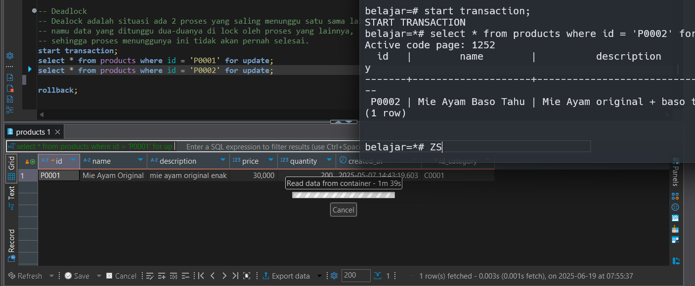


Untungnya postgresql bisa mendeteksi proses deadlock, maka jika terjadi hal serupa postgresql akan otomatis menghentikannya. 
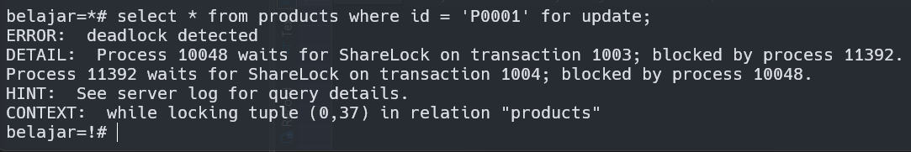
</details>


<!-- Materi schema -->
#### Schema

<details>
<summary>05:30:41 - Schema </summary>
Di POSTGRESQL terdapat fitur schema, secara default saat membuat  table sebenarnya kita membuat dan menyimpan data table kita di dalam schema public. Gambarannya sama seperti kita menyimpan file-file didalam sebuah folder. 

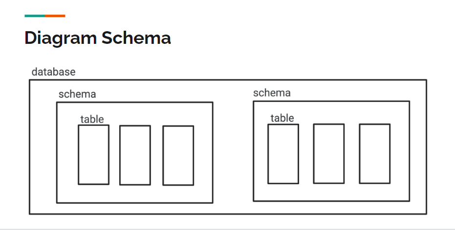

Di Postgresql kita bisa membuat schema sendiri, berikut sql untuk schema: 
```sql 
--melihat current schema  
select current_schema();
show search_path;
-- membuat dan emnghapus schema
create schema contoh;
create schema contoh1;
-- hati-hati bisa menghapus seluruh schema 
drop schema contoh;
drop schema contoh1;
-- pindah schema dari public ke contoh
set search_path to contoh;
```
Dengan adanya schema ini memungkinkan kita untuk membuat 2 tabel dengan nama yang sama disatu database tetapi berbeda schema. Saat kita membuat table otomatis table akan dibuat pada schema yang sedang dipilih ``current_schema``. Maka ketika kita ingin mengakses ataupun melakukan perubahan pada schema lain dari schema yang digunakan, kita bisa menambahkan nama ``nama_schema.nama_table`` di sqlnya. Misalkan :
```sql 
-- current_schema di contoh, ingin melihat table produk di schema public:
select * from public.products;
-- currrent_schema di public, ingin membuat table di schema contoh
create table contoh.products(
	id serial not null,
	name varchar(100) not null,
	primary key(id)
);
-- insert ke products yang ada di schema contoh saat berada di schema public
insert into contoh.products(name)
values  ('iphone'),
        ('Play station');
```
</details>


<!-- materi user management -->
#### User Management 

<details>
<summary> 05:41:29 - User Management </summary>
Secara default user utama yang dibuat otomatis saat installasi postgres (nama user linux/mac) itu defaultnya memiliki hak akses super administrator. Proses memanage user hanya bisa dilakukan oleh user yang memiliki hak akses super administrator.

> pro tip: sebaiknya saat menggunakan postgresSQL aplikasi yang dibuat/diproduction, tidak disarankan menggunakan user utama. lebih baik membuat user baru yang khusus untuk tiap aplikasi dan dibatasi hak aksesnya untuk tiap user tersebut.

SQL membuat dan menghapus user, detail perintahnya bisa dilihat [disini](https://www.postgresql.org/docs/current/sql-createrole.html). Contoh sql membuat dan menghapus user:
```sql
-- membuat
create role yusuf;
create role anisa;
-- menghapus
drop role yusuf;
drop role anisa;
```
sql merubah user, detail dokumentasinya bisa dilihat [disini](https://www.postgresql.org/docs/current/sql-alterrole.html). Contoh sql merubah user:
```sql
-- merubah password user 
alter role yusuf login password 'rahasia';
alter role anisa login password 'rahasia';
```
Adapun cara untuk memberikan hak akses pada user yaitu dengan ``grant``, detailnya bisa dilihat [disini](https://www.postgresql.org/docs/current/sql-grant.html). Contoh penggunaan grant:
```sql
-- memberi hak akses update, insert, dan select user "yusuf" pada semua table di schema public
grant insert, update, select on all tables in schema public to yusuf;
-- memberi hak akses menggunakan dan update sequence "guestbooks_id_seq" untuk user "yusuf"
grant usage, select, update on guestbooks_id_seq to yusuf;
-- memberi hak akses insert, update, select user "anisa" pada table customer saja
grant insert, update, select on customer to anisa;
```
</details>


<!-- Materi backup -->
#### Backup Database

<details>
<summary>05:53:58 - Backup Database </summary>

> Pro tips : ada baiknya kita selalu melakukan backup data secara reguler

Untuk melakukan backup database tidak menggunakan perintah SQL, melainkan menggunakan command postgreSQL, namanya adalah ``pg_dump`` [lebih detailnya](https://www.postgresql.org/docs/current/app-pgdump.html).
```
pg_dump --host=localhost --port=5432 --dbname=belajar --username=yourname --format=plain --file=Users/yourname/backup.sql
```
</details>


<!-- materi restore -->
#### Restore Database

<details>
<summary>05:59:20 - Restore Database </summary>

Buat database baru dengan nama ``belajar_restore``

```sql 
create database belajar_restore;
```
lalu restore backup sebelumnya backup.sql ke db belajar_restore dengan perintah psql :

```
psql --host=localhost --port=5432 --dbname=belajar_restore --username=yourname --file=Users/yourname/backup.sql 
```
</details>


<!-- materi selanjutnya -->
#### Materi Selanjutnya

<details>
<summary> 06:03:54 - Materi Selanjutnya</summary>
Postgresql dah tamat materi selanjutnya:

* postgresql ACID
* postgresql table partitioning
* studi kasus database desing psql
* belajar bahasa pemograman
</details>


<details>
<summary> </summary>

</details>


